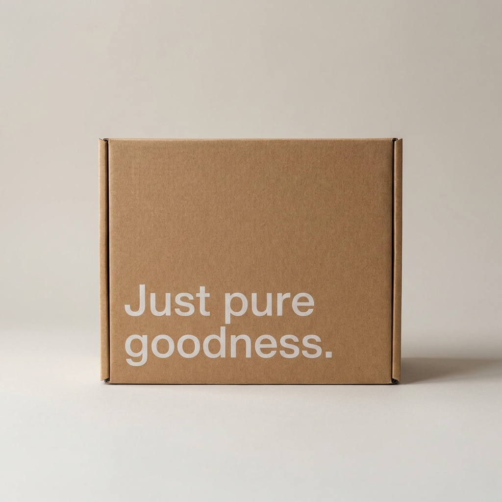

# Arshad - Premium Beverage Startup Website

A high-fidelity front-end recreation of the award-winning Belgian beverage website **misuko.be**, rebuilt from the ground up with a custom design system, modern typography, and AI-generated assets.



## 🌟 Overview

This project serves as a showcase of premium web design and development capabilities. It captures the minimalist, sophisticated aesthetic of original beverage brands while tailoring the experience for **Arshad**.

### Key Features:

- **Custom Design System**: Replicated the premium light-cream and ecru palette with sharp-edged, high-fashion styling.
- **AI-Generated Assets**: All product and lifestyle photography was custom-generated using advanced AI to match the brand's identity.
- **Responsive & Interactive**: Full support for desktop, tablet, and mobile with smooth scroll-reveal animations.
- **Modular Architecture**: Clean, semantic HTML and reusable CSS components.

---

## 🚀 Tech Stack

- **Languages**: HTML5, CSS3, JavaScript (Vanilla)
- **Design Tokens**: Custom CSS Variables for rapid rebranding
- **Typography**: Inter (Google Fonts) for a modern, geometric feel
- **Animations**: Custom scroll-reveal logic for a cinematic user experience

---

## 📸 Visual Showcase

### Ecosystem & Management

Detailed management cards with custom-themed icons and hover effects.


### Story & Values

Interactive "Our Story" page featuring technical deep-dives into production.


---

## 💼 Hire Me for Freelancing!

Looking for a **premium, high-conversion website** like this? I am currently available for freelance projects!

I specialize in:

- **Landing Page Design**: Creating "WOW" factor experiences for your brand.
- **Brand Recreation**: Rebuilding your favorite sites with modern optimization.
- **UI/UX Development**: Clean, responsive, and accessible interfaces.
- **Performance Tuning**: Lighting fast load times and smooth interactions.

### Get in Touch:

- **GitHub**: [mohamedarshad-code](https://github.com/mohamedarshad-code)
- **Portfolio**: _Include your link here_
- **Contact**: _Include your email/telegram here_

---

## 🛠️ Installation & Usage

1. Clone the repository:
   ```bash
   git clone https://github.com/mohamedarshad-code/juice-world.git
   ```
2. Open `index.html` in any modern web browser.

---

© 2026 Arshad. Recreated with passion.
